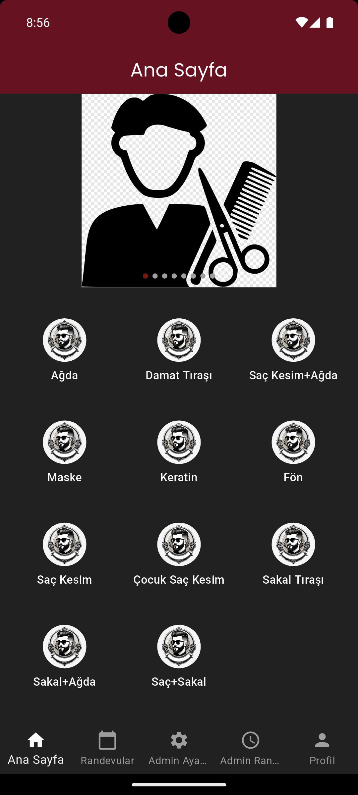
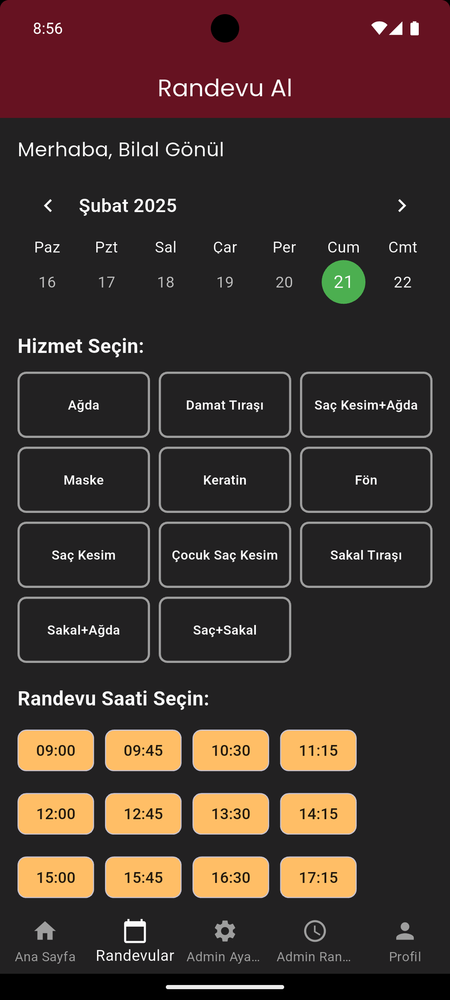
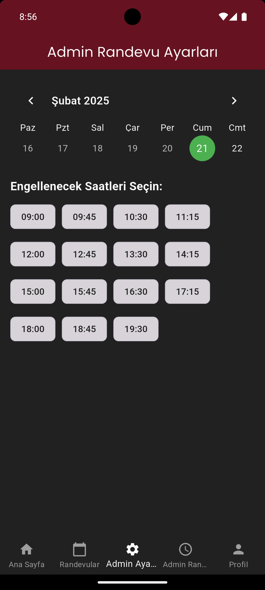
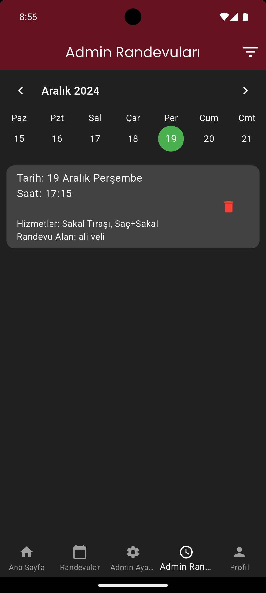
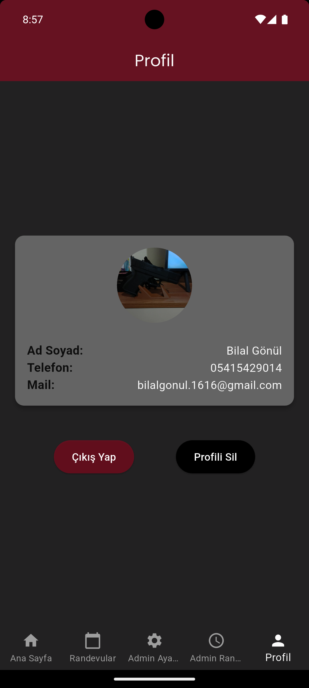

# 💇‍♂️ Salon Kuaför Randevu - Flutter Uygulaması ✂️

📲 **Salon Kuaför Randevu**, kullanıcıların kolayca kuaförlerden randevu almasını sağlayan, rezervasyon sonrası bildirimler gönderen şık ve kullanıcı dostu bir Flutter uygulamasıdır.

---

## 🚀 Özellikler  
- 📅 **Kolay Randevu Planlama**: Tarih ve saat seçimi ile hızlı randevu oluşturma  
- 🔔 **Anlık Bildirimler**: Randevu hatırlatıcıları ve onay bildirimleri  
- 🌐 **Firebase Entegrasyonu**: Gerçek zamanlı veri senkronizasyonu ve kimlik doğrulama  
- 🖼️ **Profil Yönetimi**: Kullanıcılar için kişiselleştirilmiş profil sayfası  
- 📷 **Görsel Galeri**: Kuaför salonlarına ait fotoğraflar  
- 🕑 **Randevu Takvimi**: Takvim görünümü ile tüm randevulara erişim  
- 💌 **Randevu Bildirimleri**: Flutter Local Notifications ile hatırlatmalar

---

## 🖼️ 📱 Uygulama Görselleri









---

## 🛠️ Kullanılan Paketler  

| Paket                     | Sürüm   | Açıklama                                   |
|---------------------------|---------|---------------------------------------------|
| `cupertino_icons`         | ^1.0.8  | iOS stilinde ikonlar                        |
| `firebase_auth`           | ^5.3.2  | Firebase kullanıcı kimlik doğrulaması        |
| `firebase_core`           | ^3.7.0  | Firebase çekirdeği                          |
| `firebase_storage`        | ^12.3.5 | Firebase dosya yükleme ve depolama           |
| `firebase_messaging`      | ^15.1.4 | Bildirim gönderimi için Firebase Messaging   |
| `cloud_functions`         | ^5.1.4  | Firebase Cloud Functions desteği             |
| `cloud_firestore`         | ^5.4.5  | Firebase Firestore veritabanı                |
| `google_fonts`            | ^6.2.1  | Google Fonts desteği                        |
| `flutter_image_slideshow` | ^0.1.6  | Resim slayt gösterimi                       |
| `circular_profile_avatar` | ^2.0.5  | Yuvarlak profil resmi widget'ı              |
| `table_calendar`          | ^3.1.2  | Takvim bileşeni                             |
| `image_picker`            | ^1.1.2  | Görsel seçme özelliği                       |
| `intl`                    | ^0.19.0 | Tarih ve saat biçimlendirme                 |
| `flutter_localization`    | ^0.2.2  | Çoklu dil desteği                           |
| `shared_preferences`      | ^2.3.3  | Yerel veri depolama                         |
| `flutter_local_notifications`| ^18.0.1 | Cihaz içi bildirimler                    |
| `permission_handler`      | ^11.3.1 | İzin kontrol ve yönetimi                    |
| `http`                    | ^1.2.2  | HTTP istekleri                              |
| `flutter_dotenv`          | ^5.2.1  | Ortam değişkenleri yönetimi                 |
| `googleapis_auth`         | ^1.6.0  | Google API kimlik doğrulama                 |
| `flutter_animate`         | ^4.5.2  | Akıcı animasyonlar                          |

---

## ⚡ Kurulum ve Çalıştırma  

```bash
git clone https://github.com/kullaniciadi/kuafor_randevu.git
cd kuafor_randevu
flutter pub get
flutter run


🌐 Firebase Yapılandırması
- Firebase Console üzerinden yeni bir proje oluştur.
- google-services.json (Android) ve GoogleService-Info.plist (iOS) dosyalarını android/app ve ios/Runner dizinlerine yerleştir.
- Firebase Authentication, Firestore ve Cloud Functions yapılandırmalarını tamamla.

📩 Bildirim Kurulumu
- Firebase Cloud Messaging (FCM) ile push bildirimlerini yapılandır.
- flutter_local_notifications ile uygulama içi bildirimleri destekle.